# Craftworks – Portfolio Project 1

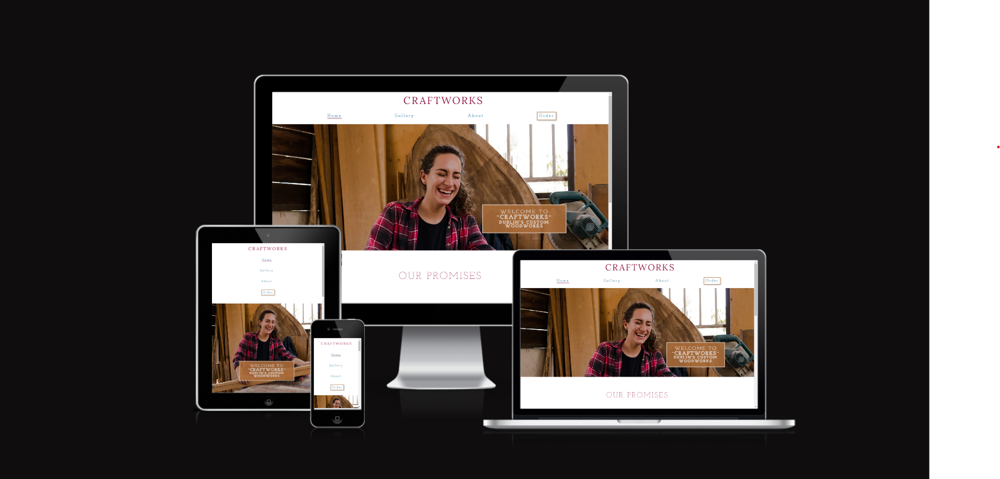

## [Link to live web application]( https://beratzorlu.github.io/Craftworks/)

---

## Project Documentation
### Welcome to Craftworks

Craftworks is a web development project developed as a part of Code Institute’s full stack web development curriculum. It is structured around creating an interactive front-end web application while mainly using HTML5 and CSS3 languages from ground up.

This documentation covers information about the central principals drove the project. As a synopsis, the reader will learn more about the UX/UI development, application testing and deployment, code structure and maintainability, bug fixes, overall design process and the future plans for the project.

The subject of this project, Craftworks, is a fictional woodworks workshop based in Dublin that offers services to customers that help build their household furniture projects. More details about the design of the website and Craftworks as a company will follow in the remainder of this documentation.

Principles of CARE had a significant impact on the creation of this project where cohesion, accessibility, responsivity and essentiality were key notions that directly influenced the end product.

---

## Table of Contents

-	[User Experience (UX)](#user-experience-ux)
    -	[User Stories](#user-stories)

-	[Design Process](#design-process)
    -	[User Experience Design (UXD)](#user-experience-design-uxd)
    -	[Wireframes](#wireframes)
    -	[Colour Palette](#colour-palette)
    -	[Typography](#typography)
    -	[Images](#images)

-	[Website Features](#website-features)
    -	[Shared Elements](#shared-elements)
    -   [Home](#home)
    -	[Gallery](#gallery)
    -	[About](#about)
    -	[Order](#order)
    -	[Thank You](#thankyou)
    -	[404 Page](#404-page)

-   [Future Features](#future-features) 

-	[Testing](#testing)
    -   [User Stories Testing](#user-stories-testing) 
    -   [Browser Testing](#browser-testing)
    -   [Device Testing](#device-testing)

-	[Validation](#validation)
    -	[HTML](#html)
    -	[CSS](#css)
    -	[Lighthouse](#lighthouse)
    -	[Accessibility](#accessibility)
    -	[Mobile Compatibility](#mobile-compatibility)

-	[Bug Fixes](#bug-fixes)

-	[Deployment](#deployment)

-	[Version Control](#version-control)

-	[Future Features](#future-features)

-	[Technologies Used](#technologies-used)
    -	[Hardware](#hardware)
    -	[Software](#software)

-	[Credits](#credits)

-	[Closing Words](#closing-words)

---

## User Experience (UX)

This project aims to achieve the core purpose of directing a user interested in buying custom wooden furniture in Dublin to the functionality available on this web application.

### User Stories

- User Stories

    - As a user, I want to be able to see a section about the ethos and philosophy of the company.
    - As a user, I want to be able to see previous work produced by the workshop.
    - As a user, I want to be able to view the workshop opening times, location, and contact details.
    - As a user, I want to be able to place an order.
    - As a user, I want to be able to see how to follow the workshop on social media.

- Objectives

    - Client Objectives:
        - For potential customers to find the workshop.
        - For potential customers to place an order by telephone or form.
        - To represent a positive brand image for attracting potential customers to the shop.
        - To provide examples of products to promote transparency.
        - To encourage current customers to stay up-to-date about their order.

    - First Time Customer Objectives:
        - To easily locate the physical workshop.
        - To see examples of furnitures available.
        - To easily find contact information.
        - To place an order.
        
    - Frequent Visitor Objectives:
        - To follow the workshop's social media channels to further connect with the company.
        
    - Returning Customer Objectives:
        - To have the most recent contact and customer feedback information.

---

## Design Process

### User Experience Design (UXD)

The five pillars of user experience discussed in Code Institute's curriculum heavily informed the uxer experience design process. These are namely strategy, scope, structure, Skeleton and surface.

- ### Strategy 

    Having no prior knowledge of the woodworks industry, research surrounding the active businesses in the woodworks industry that operate in Dublin was paramount. As a result, two companies stood out as prominent and inspirational examples to understand the expectations in terms of web design: [Custom Furniture Ireland](https://www.customfurniture.ie/) and [Diamond Furniture Ireland](https://www.diamondfurniture.ie/). While these two companies did not have direct a impact on the choice of elements and features, they informed the project of the overall functionality that the website of a custom woodworks company would need.

- ### Scope

    User stories and objectives inform the overall scope of this project. While it is important to research the existing entities in the same industry in Dublin, it is possibly more so to understand the potential needs of a user. Thus, there was a close relationship between the user stories and feature design throughout the entirety of the project.

- ### Structure

    In regards to the structure of the website, much of the implementations followed the conventions in web design. However, it is important effectively take advantage of this situation by organizing content that make themselves easier to find and inviting to interact with. Examples of this available in the project are using hover effects on page links and adding zoom to the gallery items.

- ### Skeleton

    The design approach in this area was minimalistic with an emphasis on a balance between form and function. Across all the pages, a user will find concise information with a welcoming tone of language accompanied by interactive and visiual elements. This allows the users to obtain and digest relevant information as soon as possible without spending too much time navigating across the website. Each page of the project contains unique elements that promote a feeling of familiarity from the user.

- ### Surface

    In keeping with the approach to the incorporation of the skeleton plane, the surface plane contributes to this project in the form of situating features and elements into a "clean" and "spacious" visual design approach. Because of this, users will find white space and thin font styles that do not carry much weight on the screen but offer aesthetic value without sacrificing readability.

---

### Wireframes

### Colour Palette

Implementation of a colour palette that prioritized maintaining a balance between aesthetic quality and readability produced a result that satisfied the needs of this project.

[Coolors](https://coolors.co/) was a highly beneficial resource in this regard which provided significant help in identifying
matching colours that also have appropriate contrast.

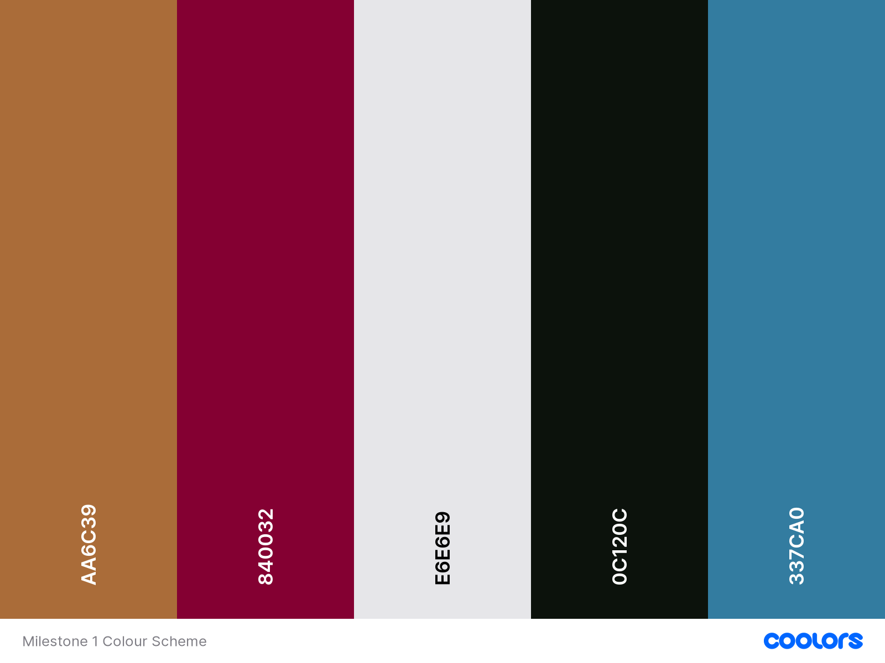

---

### Typography

[Code Institute](https://codeinstitute.net/ie/)'s reccomended approach to choosing fonts on [Google Fonts](https://fonts.google.com/about) was sufficient in finding satisfactory font families. The below is the list of fonts used to stylize the text content of the project;

- Headings: Lora (Normal 400)
    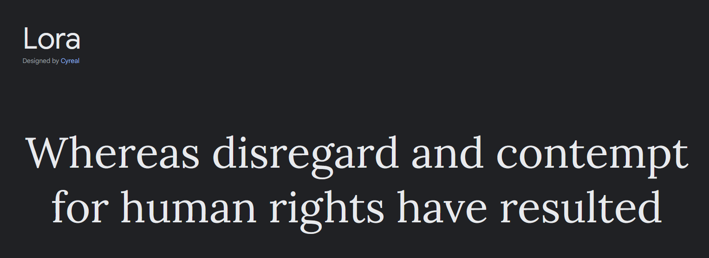 
- Smaller Headings: Josefin Slab (Light 300)
    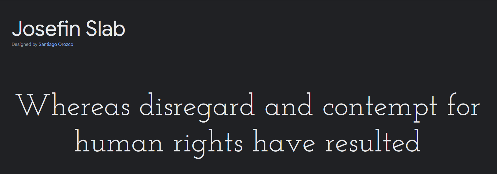
- Text: Frank Rurl Libre (Light 300)
    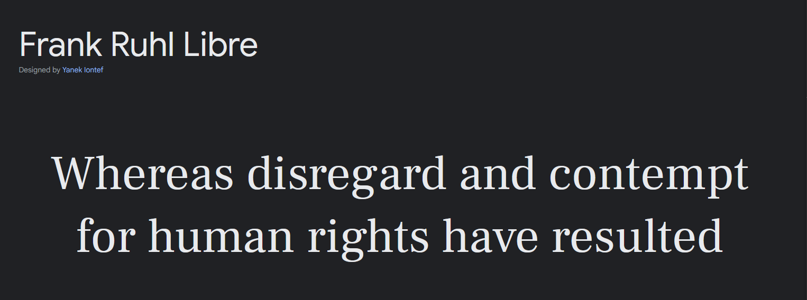 

However, while this list provided an consistent aesthetic for the website, there have been situations where some of the font types were used outside of their determined purpose. For example, using Lora and Josefin Slab interchangibly at times for purposes of cohesion.

---

### Images

The overall imagery present on the website consists of pictures that have at least a minor connection with the theme of woodworks.
Conveying a welcoming and organized visual language was the main approach towards deciding what images to choose specifically. However, at the same time as this idea, it was equally important to ensure that the pictures displayed the physical actions associated with craftsmanship while also displaying a positive outlooks towards similar labour. This is most apparent in the hero images sections.

[Pexels](https://www.pexels.com/) and [Pixabay](https://pixabay.com/) were the platforms that this project resourced its image files from.

---

## Website Features

The design considerations that impacted the envisioned fatures were mainly structured around convential website design. While there were more features planned in the initial stages of the project, some were not entertained to the benefit of serving the needs referenced in the [User Stories](#user-stories) section. Thus, it was important to focus on a minimum viable project rather than prioritizing the implementation of further features for the sake of it. This would only bloat the website without adding much value to the user experience overall.

### Shared Elements

The below elements are available to be experienced by the user across the website as a whole.

- #### Navigation

Taking a straigtforward and practical approach to resulted in the creation of the navigation element provided above. All elements have hover effects to provide user feedback and underlines to display the active page. The order page has unique styling to emphasize the core function of the project; to encourage customers to make use of the services provided by Craftworks by placing an order. The logo is displayed at all times to motivate a feeling of familiarity in the user.

- #### Hero Image and Text Card

In keeping with the points available in the [Images]{#images} section, the choice of hero image here represents a positive outlooks towards the actions associated with woodworks. By displaying a lauging lady holding a wooden material while, the hero image section aims to instill a sense of welcoming from the user.

While the content inside the text card is not identical the framework itself is shared across the website. This serves multiple purposes by both welcoming and reassuring the users of which page they are currently displaying on their respective devices.

- #### Footer

The footer represents a minimalistic design philosophy. The social media websites of the company are displayed openly and clearly by providing appropriate spacing and medium-size social media logos. There is also a signiture text provided in the bottom center of the footer to refer users to the developer responsible for this project. ([Berat Zorlu](https://github.com/beratzorlu/Craftworks))

- #### Favicon

Designing a favicon for the website as a process that required a series of trials and errors to find the design that fit the project most appropriately. Providing image sizes that also fit different browsers and devices an important concern regarding this area. 

[Canva](https://www.canva.com/) was the service that allowed the design and creation of this element.

### Home

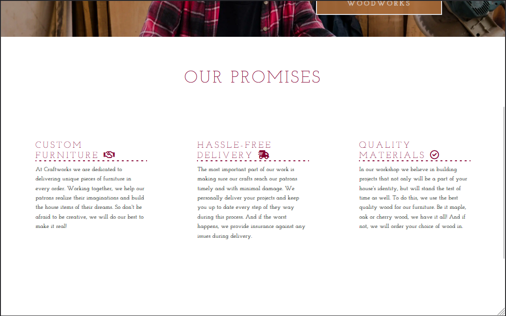

The home page mainly serves the purpose of communicating the core purpose and motivations of Craftworks both as a company and a social community. Through the "Our Promises" section, users are able to learn about the quality of the prodcuts, delivery assurance as well as the enthusiasm of the company to work alongside their customers to produce an end product.

### Gallery

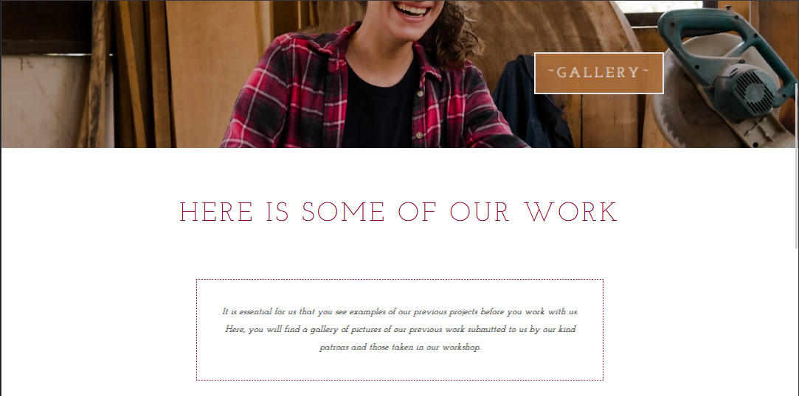

Users are greeted to the section with a box of text inviting them to interact with the following gallery feature and learn more about the production quality of the company. This provides transparency about the capacity of the company to deliver on their promises mentioned in the [home](#home) section.

- #### Gallery Grid

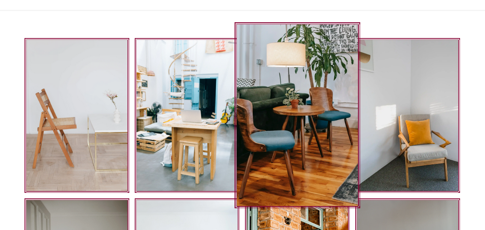

This element is practically the critical companent of this project. The gallery grid serves to compel the users and provide them an aesthetically pleasing viewing experience during their time exploring the website. Having found an interactive gallery element displaying instances of successful products, it is more likely for the users to view the order form.

### About

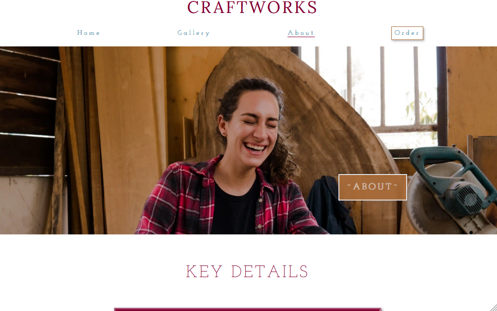

Structurally the about page shares designs visible in the previous pages, however, the section itself includes key details for users to successfully communicate with and locate the workshop.

- #### Key Details Info Card

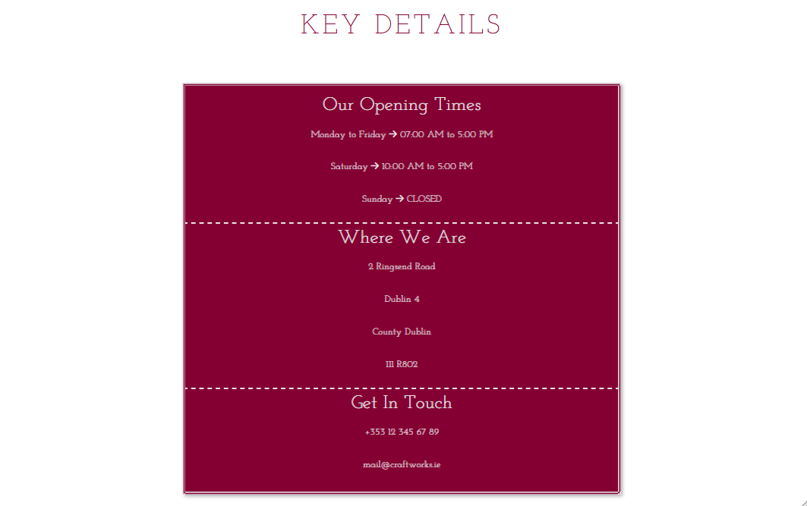

This information card provides all the necessary details for a customer or user to effectively ineract with the company. Thus, the about section specifically refers to this need by displaying this element as its content. This straightforward approach allows the user to directly access all the information they need about the company. 

While it would have been practical for the user to find this information in the home page, it was more fitting to recognize user agency by allowing them to display such information *if* and *when* they want by clicking on the about link.

### Order

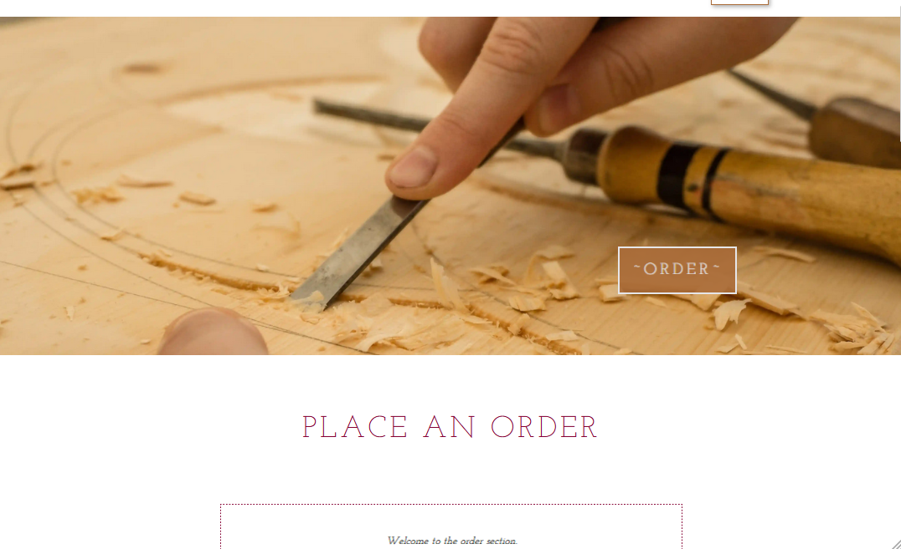

Once users reach the order page they will find a unique hero image accompanied by a text box detailing the ordering process. By displaying hands working on wooden material, the order page aims to communicate that work is about to begin. It also features a background image of a workshop to further reinforce this idea.

- #### Order Form

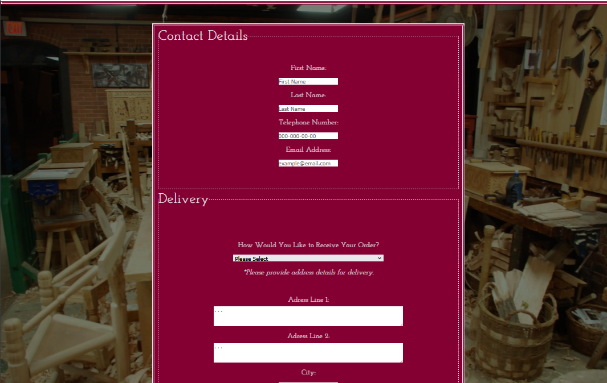

The order form represents the core function of the website. It is the way in which the users establishes a direct connection with the services that the company offers. The form includes all necessary details and input for a user to communicate their design ideas and demands as well as their contact information and choice of payment. All these elements combined allow for the submittion of a complete and informative experience for both sides. 

- #### Order Button

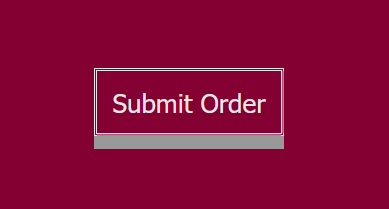

While this is not a necessary feature for the form to function as intended, it allowed for an opportunity to demonstrate my aptitude regarding the implementation of HTML and CSS into the project. Moreover, providing a button that reacts and responds to the interactions of the user improves the overall experience gained from submitting the form.

### Thank You

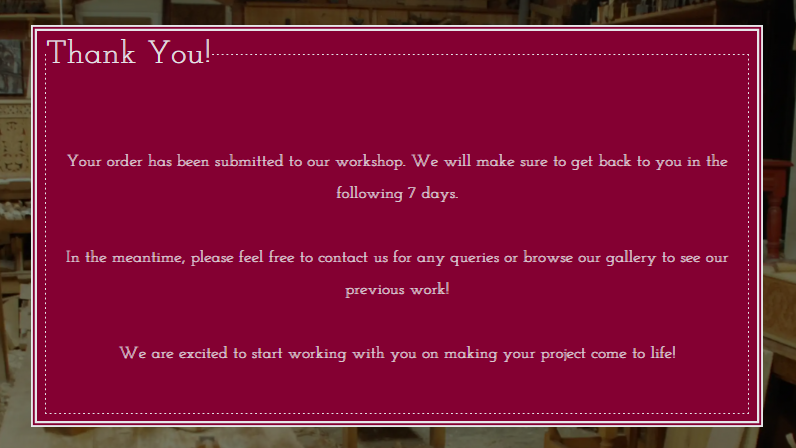

The thank you page shares its structure with the [Order Form](#order-form) page. It's main purpose is to reassure the user that the form worked as intended and successfully completed the query initiated by the customer. Thus, ensuring that everything is functioning properly and that there is no cause for concern.

### 404 Page

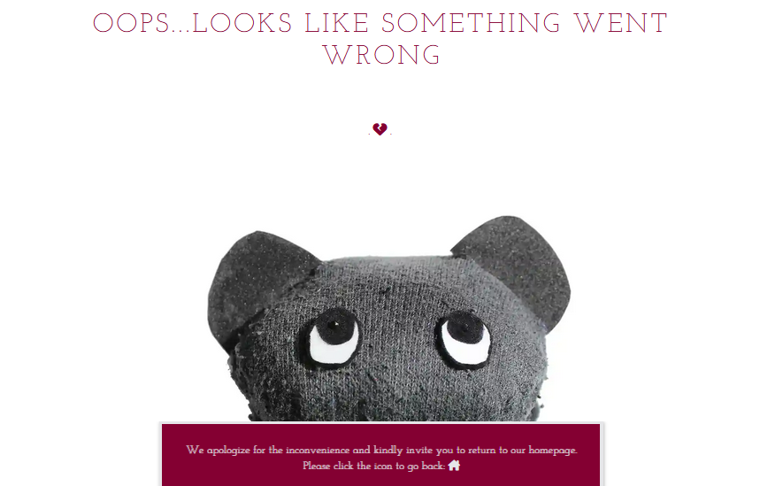

404 pages are elements that are not commonly visible to the user. Thus, this page aims to help navigate users back to the home page to prevent them from feeling lost. The 404 page is a unique element within the project is it leverages the fact that it will not be commonly visible to the users by displaying a puppet as comic relief.

---

## Future Features

- ### Back to Top Button
    - This will help with easier navigation.
- ### Interactive Infographic for Ordering Process
    - Users will be able to access and digest relevant information.
- ### Order Tracking & Updates
    - It is beneficial for both parties to ensure there is constant communication between the company and the customer. Providing real-time information about their order is an effective way to achieve this.
- ### Creative Club Section
    - Another section that invites customers to sign up to learn about woodcrafts would provide another stream of income as well as another interactable form element on the website. 
- ### Hero Video
    - This would improve the overall look of the website by providing a more professional aesthetic to the webpage. The video would need to be muted and looped.

---

## Testing 

The testing procedure began immediately after the deployment of the website on [GitHub Pages](https://pages.github.com/). Early deployment was import to ensure the reliability of the features available in the project before moving on to implementing further elements. Friends and family were important players in the testing process who were happy to constantly play with the deployed website to see if they can find issues and suggest improvements; I am grateful for their commitment and help.

- ### User Stories Testing 

    - As a user, I want to be able to see a section about the ethos and philosophy of the company.
        - 
    - As a user, I want to be able to see previous work produced by the workshop.
        - 
    - As a user, I want to be able to view the workshop opening times, location, and contact details.
        - 
    - As a user, I want to be able to place an order.
        - 
    - As a user, I want to be able to see how to follow the workshop on social media.
        - 

- ### Browser Testing
- Three major internet browsing applications were used for the browser testing process producing an overall satisfactory result.
    - Firefox
        - 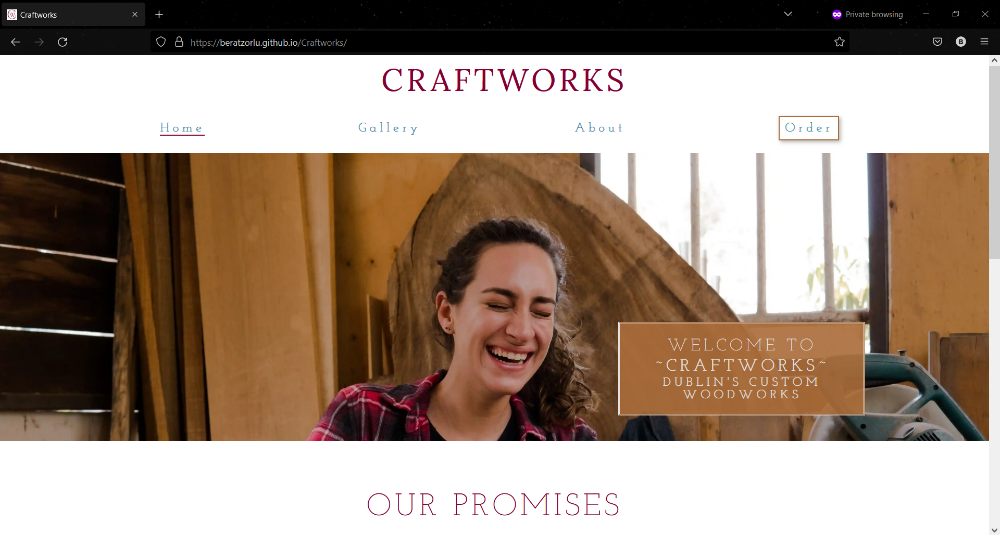
    - Chrome
        - 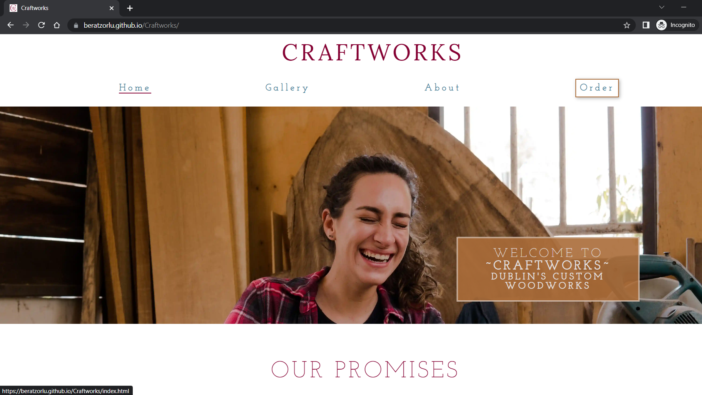  
    - Edge
        - 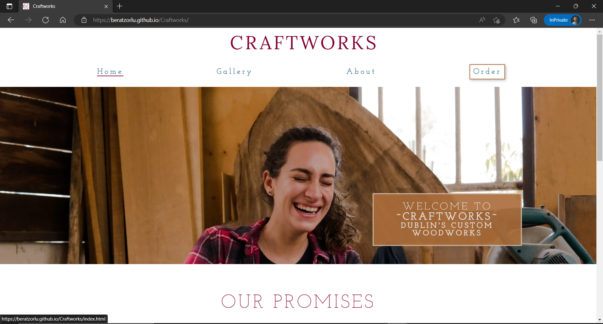

- ### Device Testing
- The devices provided below are items that were available at the time of the device testing process. While there was a gap in the amount of platforms accessable at the time, the test outcome incorporates 2 main mobile platforms and a powerful gaming laptop. 
    - Monster Abra A5 V13.4 15.6" Laptop
        - 
    - Apple Iphone 7 Plus
        - 
    - Samsung Galaxy A51
        - 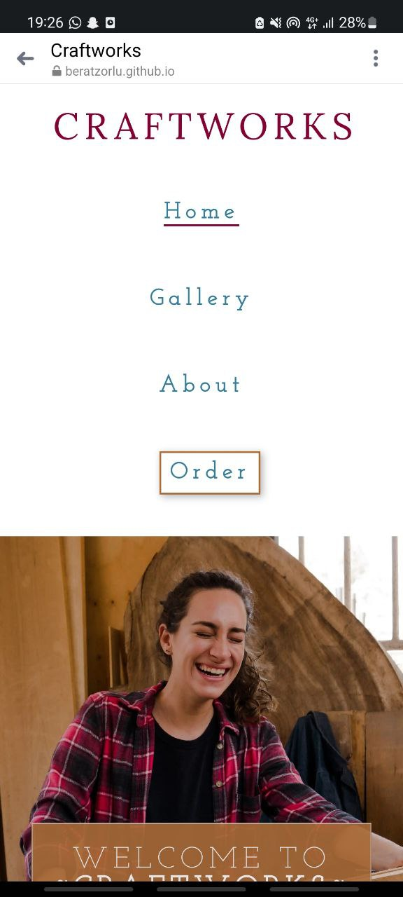

---

## Validation

### HTML

- Home
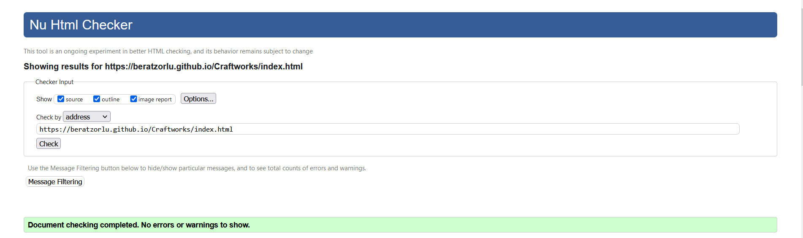
- Gallery
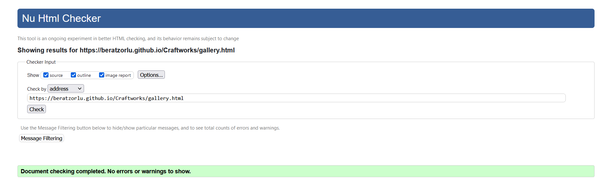
- About
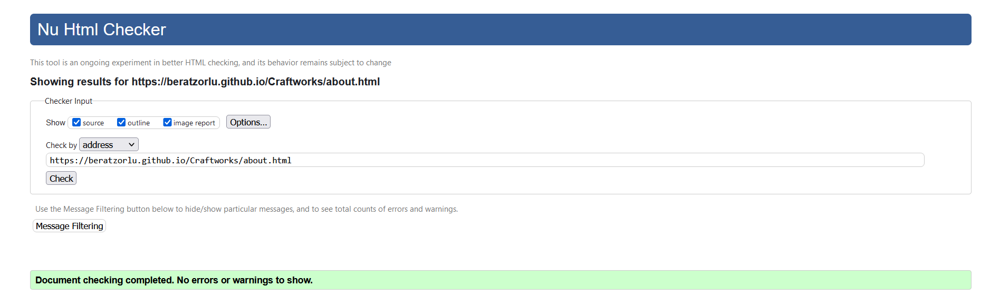
- Order
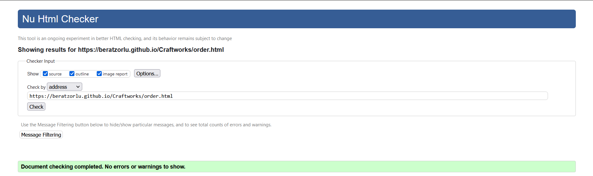
- Thank You
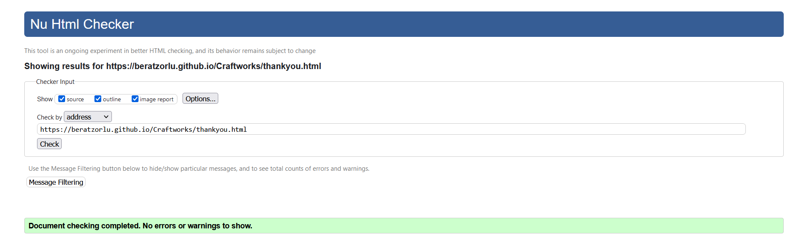
- 404
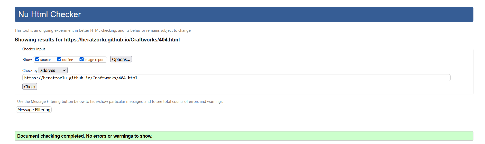

### CSS

- styles.css
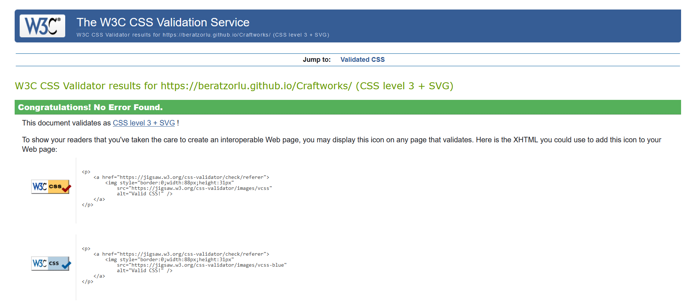

### Lighthouse

- Mobile 
    - 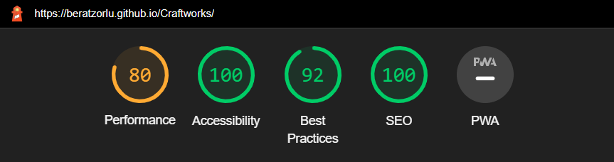
- Desktop 
    - 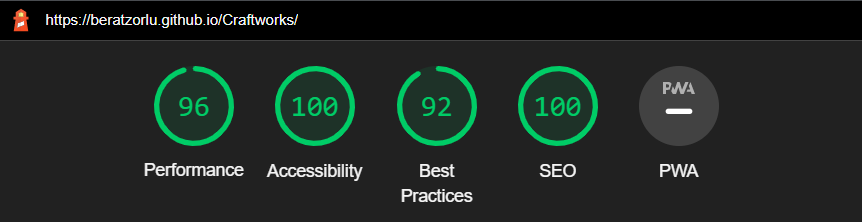

### Accessibility

- Home
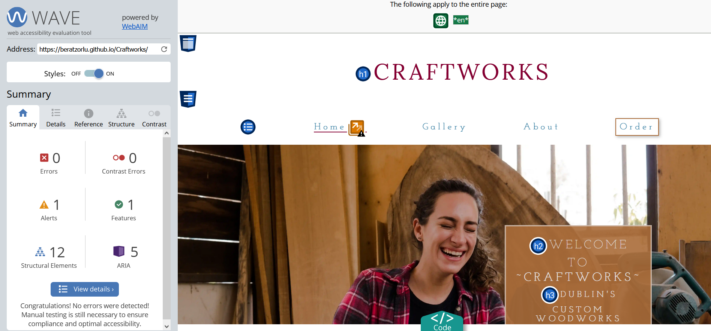
- Gallery
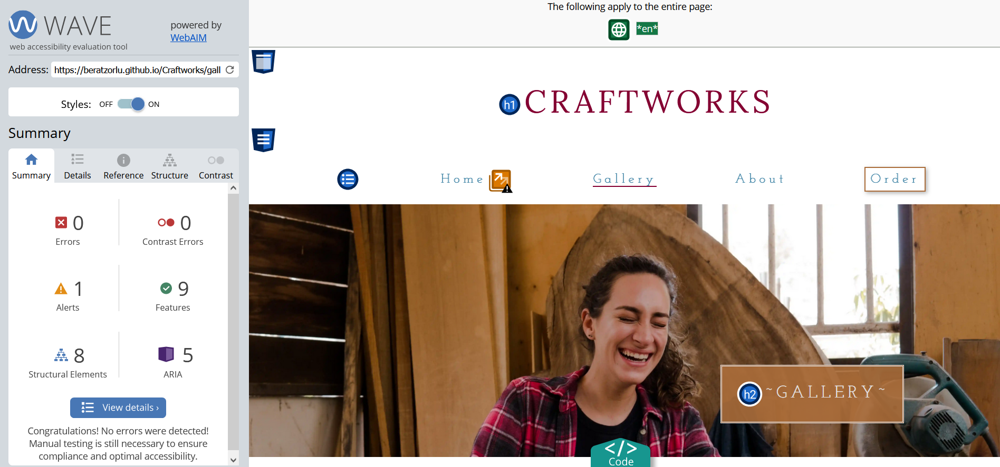
- About

- Order
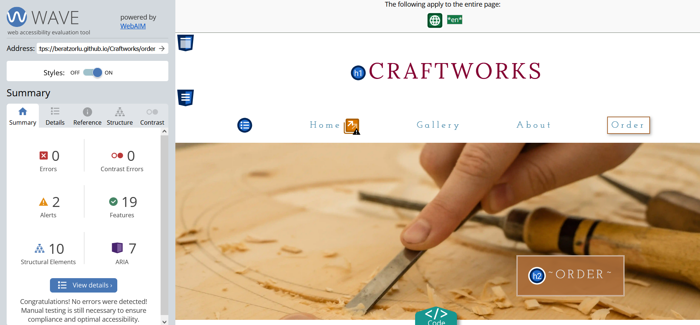
- Thank You
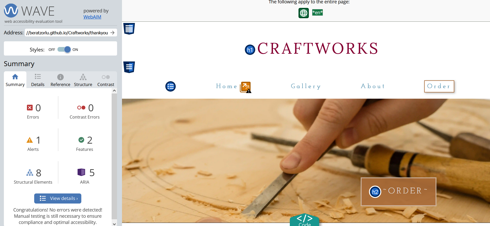
- 404
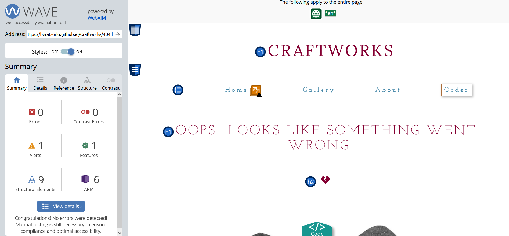

### Mobile Compatibility

- Mobile-Friendly Test
    - 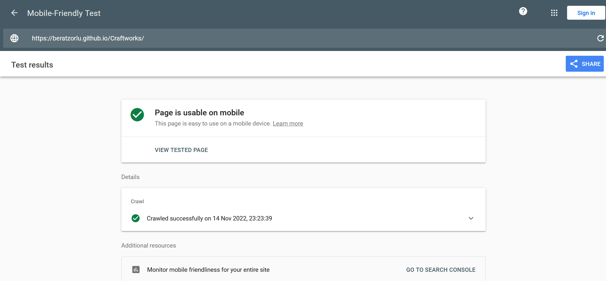

---    

## Bug Fixes

- Gallery Grid Image Load Failure
    - Fixed by removing the "/" present before the relative path declarations in the associated HTML code.
- Navigation Bar Responsivity
    - Fixed by removing <code>position:absolute</code> and adding <code>display:flex</code>.
- Home Text Overflow
    - Fixes by implementing media queries to add whitespace that accomodates for the text flowing downwards.  

---

### Wireframes

{Provide the wireframe jpgs here.}

===== Before Code/implementation ===
7. Technology
8. testing
   8.1 code validation
   8.2 test cases (user story based with screenshots)
   8.3 fixed bugs
   8.4 supported screens and browsers
9. Deployment
   9.1 via gitpod
   9.2 via github pages
10. credits